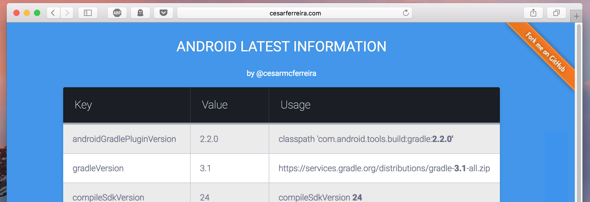

# android-latest
Latest android versions for developers.

------------
The following table was automatically generated:

<center>

| keys | values     |
|:-----------:|:--------:|
| latestAndroidVersionNumber | 7.0 |
| latestAndroidVersionName | Nougat |
| latestAndroidReleaseDate | 22 August 2016 |
| latestAndroidVersionCode | 24 |
| compileSdkVersion | 24 |
| buildToolsVersion | 24.0.2 |
| minSdkVersion | 17 |
| targetSdkVersion | 24 |
| latestSupportVersion | 24.2.0 |
| buildGradleToolsVersion | 2.2.0-beta3 |

</center>

## Motivation

I'm always wondering what the latest versions of buildTools/support/etc. are, so here is a repository with the updated information for consultation.
Anyone can open a pull request if any version comes out and I fail to notice.

## Available outputs

- [data.json](data.json)
- [build.gradle](generated/build.gradle)
- [index.html](http://htmlpreview.github.io/?https://github.com/cesarferreira/android-latest/blob/master/generated/index.html)
- [README.md](generated/README.md)

## Using the `build.gradle`

Apply this in your main `build.gradle`
```groovy
apply from: 'https://raw.githubusercontent.com/cesarferreira/android-latest/master/generated/build.gradle'
```

Use the variables at will
```groovy
buildToolsVersion rootProject.ext.buildToolsVersion
```

## Installation

Just run
> `gem install erubis json colorize`

and you are free to execute the generator!


## Contributing

1. Fork the project
2. Update the `data.json`
3. Run the `ruby generator.rb`
4. Create the pull request

## License

This project is available under the MIT license. See the LICENSE file for more info.
